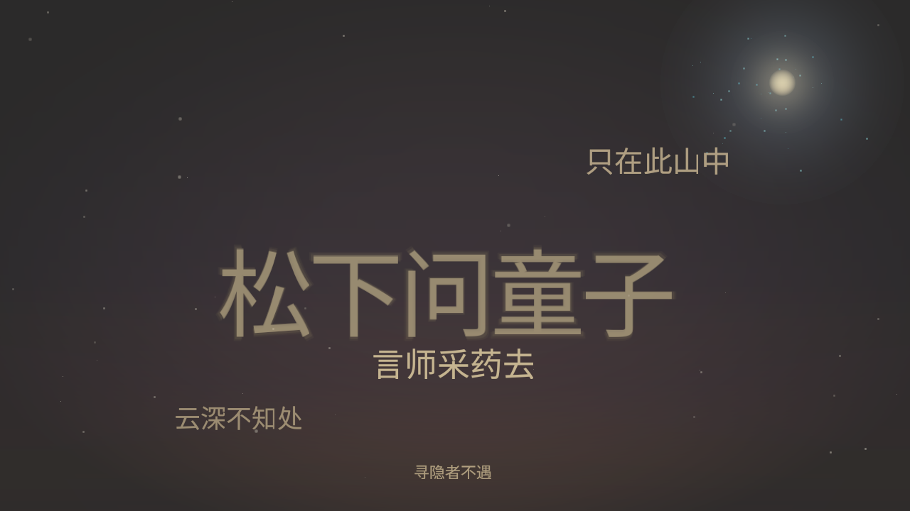

# inkflow · 墨流

一件 24 小时运行的**画廊级生成艺术摆件**：Jetson Orin Nano，无桌面、无 X、
无第三方依赖。屏幕上永远是一首完整的唐人五言绝句——主句明亮居中，其余三句
以淡墨按读序排布，深靛夜色随触控转暖；每首完整展演后换下一阕。

> **先读 [ARTIFACT.md](ARTIFACT.md)** —— 它是这件作品的自陈，也是所有改动的美学基准。

## 样帧

| | |
|---|---|
|  |  |
| 贾岛《寻隐者不遇》 | 柳宗元《江雪》 |
|  |  |
| 李白《静夜思》 | 王之涣《登鹳雀楼》 |
|  |  |
| 孟浩然《春晓》 | 触控·冷色粒子 |

## 曲目

五首完整五言绝句，按读序逐句成为主句，一阕演毕（约 90 秒）换下一阕：
贾岛《寻隐者不遇》、柳宗元《江雪》、李白《静夜思》、王之涣《登鹳雀楼》、
孟浩然《春晓》。

## 文档

- [ARTIFACT.md](ARTIFACT.md) — 美学宣言 / 作品自陈。
- [ART_DIRECTION.md](ART_DIRECTION.md) — 绑定的视觉意图。
- [ZERO_DEP.md](ZERO_DEP.md) — 零依赖硬约束契约。
- [PRODUCTION.md](PRODUCTION.md) — 已实测兑现的工程指标。
- [docs/ARCHITECTURE.md](docs/ARCHITECTURE.md) — 模块结构与数据流。

## 模块结构

```
src/
├── main.rs        — harness：--compose-test / --works-gallery / --drm-test
├── scene.rs       — 场景与槽位状态 + 生命周期（Slot / Scene / Composition）
├── background.rs  — 深靛渐变、焦部辉光、地平线暖雾、暗角、月轮、尘、火花
├── compose.rs     — 主句（入场/停留/退场/ghost + bloom）与三句淡墨、标题
├── color.rs       — 调色板、线性光混合、缓动
├── glyph.rs       — 8-bit 覆盖率字形合成
├── glyph_table.rs — 编译期字模（build_font.py 自 Noto Sans CJK 生成）
├── phrase.rs      — 句库 + 五首完整作品组
├── rhythm.rs      — 节拍引擎（Entrance / Hold / Exit / Rest）
├── surface.rs     — memory / /dev/fb0 / DRM dumb-buffer 统一 Surface
└── png.rs         — 零依赖 PNG（stored DEFLATE，严格合法）
```

退役源码（单字字墙、ollama、evdev 等旧 incarnation）在 `legacy/src/`，不参与编译。

## 常用

```bash
cargo fmt && cargo clippy --release -- -D warnings && cargo build --release
cargo test --release --lib

./target/release/inkflow --compose-test 12        # 入场→停留→触控→退场
./target/release/inkflow --works-gallery          # 五首作品逐句样张
./target/release/inkflow --drm-test               # 真机 live loop
```

`scripts/autoloop.sh`：无人值守周期轮（构建失败则跳过，绝不用旧二进制渲染）。
